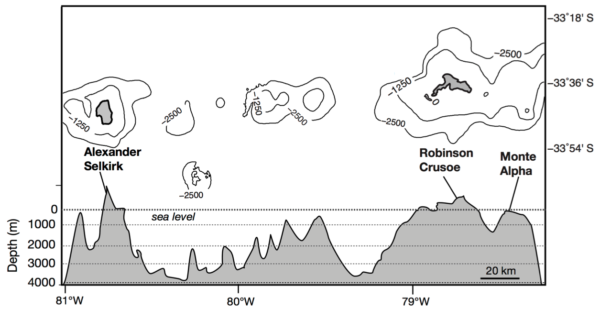
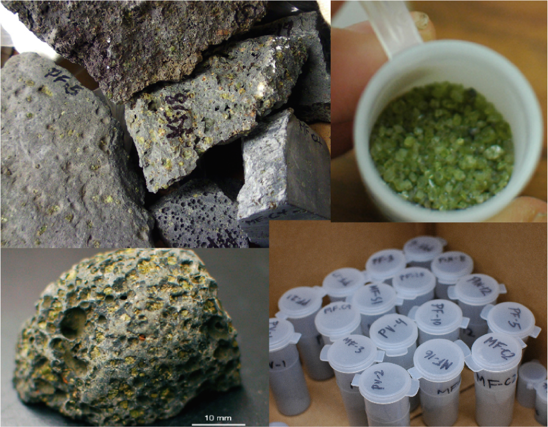

Research activities

# Juan Fernández Islands

These are an enigmatic group of islands off the coast of Chile. They are historically uninhabited, aside from goats, lobsters, and a poor shipwrecked soul. Picrites (basalts with a significant volume % of olivines) were originally termed *masafuerites*, named after the specimens found here. 

Lava samples from this small island group near Chile have puzzled geochemists since the 1980s. By the early 1990s, mantle geochemists constructed various flavors of mantle endmember compositions that might be sampled by oceanic islands. 

  
<b>Previous studies found puzzling chemical signature</b>

 Juan Fernández lavas exhibited an uncommon range of high and 3He/4He signatures, but near-constant 87Sr/86Sr and 143Nd/144Nd isotopes. Binary mixing of components with high and low 3He/4He and similar Sr-Nd isotopes was not observed at other ocean islands. Another complication was the low 3He/4He value was the same as MORB basalts (~8 RA).

One hypothesis was that He noble gas signatures decoupled from other typical tracers of mantle source composition. Plume skeptics went on to suggest that exogenous noble gases must pervade magma chambers instead of representing a mantle plume, and that this was a ridge created by decompression melting. It was even claimed that olivines were xenocrysts and therefore did not carry a plume Helium signature. 

  
 

  
<b>A study that combines the olivine-lava story</b>

  
 To understand Juan Fernández, follow the olivines and the lavas. 
   * Sr-Nd of olivines
  * Trace element compositions, Sr-Nd-Pb isotopes of lavas

 
   

  
<b>Evidence of a well-mixed, but heterogeneous plume</b>

  
 Combined trace element and Sr-Nd-Pb signatures of olivine and lavas show that the mantle source of Juan Fernández is heterogeneous but well-mixed and can be characterized as dominantly FOZO.
  * Low-3He/4He samples need not derive from depleted mantle material
  * The Pb isotope signature of Alexander Selkirk late stage basalts (with MORB-like 3/4He) consistent with EM2 source
 
 Findings were integrated to produce a schematic of plume and island chain evolution over 4 million years

# Loihi Seamount

This is the baby of the Hawaiian Islands. 

## Behavior of He-C, trace elements of Loihi's deep rift zone

Description

## Spatial variability of Pb isotopes

Of course I am still talking about Loihi

[//]: # (test comment) 
